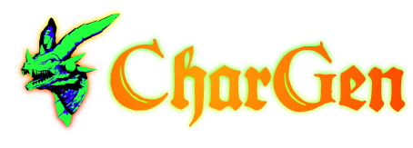
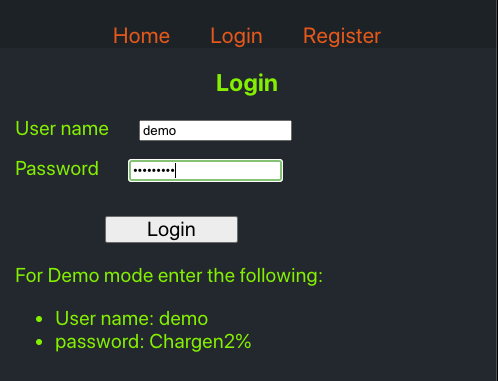
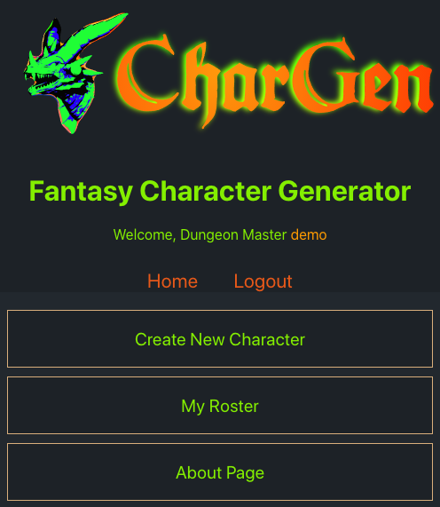
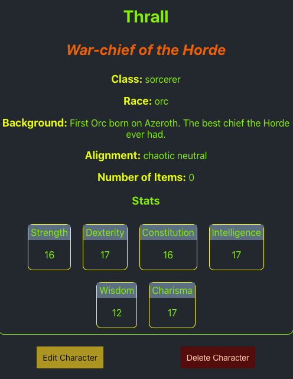
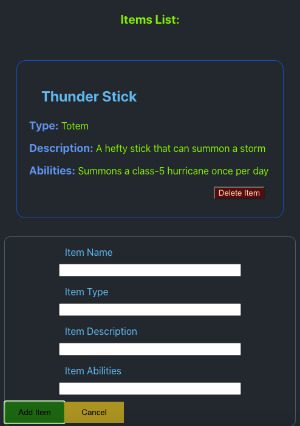

# Chargen

## Fantasy Character Generator

**Description:** Store your Dungeons & Dragons characters in this list. Create new characters, edit them, randomize their stats, and add special items to their inventories.

**Link to live app:** [https://chargen-client.vercel.app](https://chargen-client.vercel.app)

**Tech Stack:**

- **Backend** - Node.js - Express - Postgresql
- **Frontend** - React

## React Components Codebase:

This React Application is divided into 8 route-based pages and 10 mountable components.

Data is stored in two separate contexts. One for the roster and user data for authentication. One for staging a single character.

## Screenshots:

Login or create a new account first

Go to your main menu

Make edits and review

Add items

## Instructions to Clone:

1. Clone from [Github](https://github.com/warptrail/chargen-client)
2. Set up the client side from this [link](https://github.com/warptrail/chargen-api)
3. Set up your postgres database and run npm migrate
4. Make sure your .env file is set up with proper variable names
5. Run `npm run dev` or `npm start` for the api back-end code
6. Run `npm start` to open the client-side app
